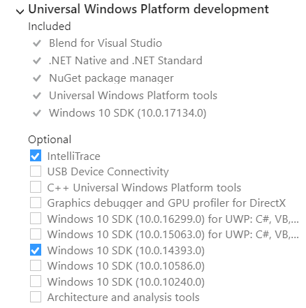
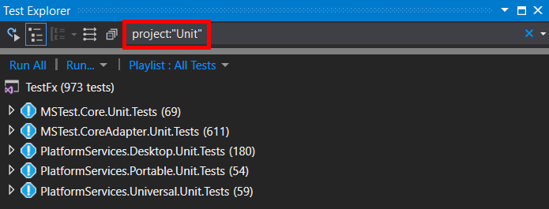

# Contribution Guide

This article will help you build, test and consume local builds of the MSTest Framework and Adapter.

## Prerequisites
Please install `Visual Studio 2017` with the following workloads:
- `.Net desktop development`
- `Universal Windows Platform development`
   - `Windows 10 SDK (10.0.14393.0)`
     
- `.Net Core cross-platform development`

See download
link [here](https://www.microsoft.com/net/core#windowsvs2017).

Clone the repository to a local directory. 

```
> git clone https://github.com/Microsoft/testfx.git
```
Lets assume `/src/testfx` as the location of the cloned repository for the rest of this article.

## Build

### Building with Visual Studio(VS)

You can open `/src/testfx/TestFx.sln` in VS and trigger a build of the entire code base using `Build Solution(Ctrl+Shift+B)` from the `Solution Explorer` or the `Build` menu.

The bits get dropped at `/src/testfx/artifacts/Debug/`.

### Building with command line(CLI)

To build the repository, run the following command:

```
> cd /src/testfx
> build.cmd
```

This would use the msbuild that Visual Studio installation brings in to build the following components
* The Framework and it inbox extensions.
* The Adapter and its platform specific components.
* Unit, Component and E2E tests related to the above components.
* Generates a nuget package for local consumption of the Framework and Adapter.

All these components get dropped at `/src/testfx/artifacts/Debug/` and the nuget packages would be at `/src/testfx/artifacts/Debug/MSTestPackages`.

To build a particular configuration, use the `-c` option. E.g. to trigger a
release build use

```
> build.cmd -c Release
```

To change the version suffix of the nuget packages generated, a `-vs` parameter can be passed through as follows (By default this is **dev**)
```
> build.cmd -vs dev-01
```

For more options, you can use
```
> build.cmd -h
```

## Test

The following are the set of tests that testfx contains:

* Unit tests
    - Very fast tests primarily validating individual units.
    - Named as `<ProjectUnderTest>.UnitTests` where ProjectUnderTest is the project under test.
* Component tests
    - Slightly slower tests with File system interactions.
    - Named as `<ProjectUnderTest>.ComponentTests` where ProjectUnderTest is the project under test.
* Smoke tests
    - End to end tests covering P0 workflows which most users would use. if these are broken, PR will not be merged.
    - Run using the Framework and adapter bits generated by the build.
    - Named as `MSTestAdapter.Smoke.E2ETests`

As a principle, the test bed would consist mostly of unit tests(~70-80%), followed by a few component tests addressing real world interactions(~15-20%) and a few end to end tests(~5-10%).

### Running tests with Visual Studio

All the tests in the testfx repo can be run via the `Visual Studio Test Explorer`. Building `/src/testfx/TestFx.sln` as described in the build section above should populate all the tests in the Test Explorer.

A specific type of tests can be run by providing a search filter in the Test Explorer window.
For instance to run unit tests use `project:"Unit"`. For running smoke tests, use the `project:"Smoke"` filter.


### Running tests with command line(CLI)

To execute tests via command line, run the following command:

```
> cd /src/testfx
> test.cmd
```

By default, only unit tests are run. To run smoke tests, one can provide the `-p` option to `test.cmd` that sets the test assembly pattern:

```
> test.cmd -p smoke
```

The `-p` option can also be used to run tests from a specific assembly. For instance to run *TestFramework* tests the following command can be used:

```
> test.cmd -p TestFramework
```

Tests can also be run for a specific build configuration (`Debug` being the default)

```
> test.cmd -c release
```

## Deployment

This section will discuss the steps to consume the locally built Framework and adapter bits that the sections above detail.

On running build.cmd, language neutral nuget packages for the Framework and Adapter with a version of `99.99.99-dev` are generated at `src\testfx\artifacts\MSTestPackages`.

### Deployment in VS
A test project can be updated to consume these nuget packages by:
1. Adding `src\testfx\artifacts\MSTestPackages` to the list of Package sources in VS via `Tools-> Options -> Nuget Package Manager -> Package Sources`.
2. Updating the versions of these nuget packages to point to `99.99.99-dev` for the test project/solution via the `Manage Nuget Package` workflow at a project/solution level.

**Note:** Owing to a caching issue in VS Test Explorer, please restart VS to ensure that these packages are actually consumed.

### Deployment through CLI/non-VS IDEs
These packages can be consumed from a non-VS IDE/editor by:
1. Updating their versions to point to `99.99.99-dev` for the test project/solution using:
```
nuget.exe update -id MSTest.TestFramework -id MSTest.TestAdapter -version 99.99.99-dev -source "<Root>\src\testfx\artifacts\Debug\MSTestPackages" -prerelease packages.config
```

Documentation for nuget.exe command line reference is [here](https://docs.microsoft.com/en-us/nuget/tools/nuget-exe-cli-reference)

## Diagnostics

The first level of diagnosis for adapter failures can start with enabling verbose logging in the Visual studio Test Platform itself. Here is how to turn that on:

* **TP V1** : [This](https://blogs.msdn.microsoft.com/aseemb/2012/03/01/how-to-enable-ute-logs/) blog helps detail setting up diagnostic logging.
* **TP V2**(The open-source cross-plat Test Platform): [This](https://github.com/Microsoft/vstest-docs/blob/master/docs/diagnose.md#collect-traces-using-command-line) section helps detail the process to enable diagnostic logging.

One can always add a `Debugger.Launch` at the main entry points:
* [MSTestDiscoverer.DiscoverTests](https://github.com/Microsoft/testfx/blob/master/src/Adapter/MSTest.CoreAdapter/MSTestDiscoverer.cs) for discovery.
* [MSTestExecutor.RunTests](https://github.com/Microsoft/testfx/blob/master/src/Adapter/MSTest.CoreAdapter/MSTestExecutor.cs) - both the overloads that take sources and tests for execution.
 Select the appropriate debugger and step through the code.
